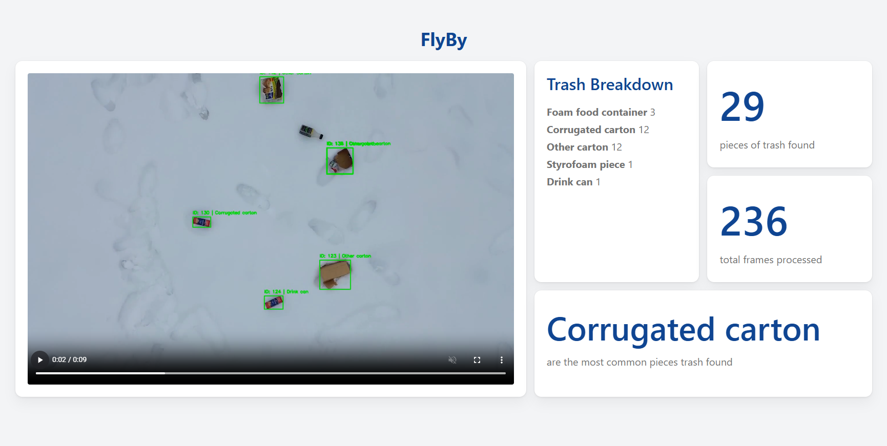

# FlyBy
> By Lawrence Miao, Miranda Zheng, and Raymond Chen

Second place winner of the 2025 NSBE x SHPE Climate Change & Sustainability Hackathon @ Rensselaer Polytechnic Institute.
## What is it?
FlyBy is a web application that leverages deep-learning computer vision to detect and analyze marine trash in aerial footage. It leverages a [YOLOv5](https://github.com/ultralytics/yolov5) vision model trained on the [TACO dataset](https://github.com/pedropro/TACO).

It was designed in response to the prompt: "Develop an application that can address the emerging and/or long-standing issues in the field of climate change and sustainability."
## How Do I Use It?
1. On the website, upload aerial footage to analyze for trash.
2. The system will take some time to analyze the video, proportional to video length.
3. The video will then be played back with bounding boxes and classifications drawn over all instances of detected trash.
4. You will also see metrics on the page including:
    - Total number of detected trash items.
    - Trash breakdown detailing the number of each item type detected.

## The Issue at Hand
Every year, 19 - 23 million tons of plastic waste are dumped into our oceans.[1](https://www.unep.org/plastic-pollution) This in turn leaks into aquatic ecosystems, polluting lakes, rivers and seas. It's polluting habitats, contributing to the already high level of methane emissions, and affecting the livelihood of all animals.[2](https://www.earthday.org/how-our-trash-impacts-the-environment/)

We're proud to present FlyBy: our solution to mitiagting this long-standing problem, made in 24 hours!

The system integrates with a drone-mounted camera to analyze oceans and other water environments, where manual waste monitoring is challenging.
## Use Cases
- Monitor distribution of waste over time
- Identify debris hotspots
- Gauge effectiveness of cleanup efforts
## Target Audiences
- Environmental Conservation Groups
- Municipal Government Waste Management Departments
## Tech Stack
**Front-end:** React with TypeScript and TailwindCSS. \
**Back-end:** Python with FastAPI and PyTorch. \
**Model:** YOLOv5 trained on the TACO dataset.